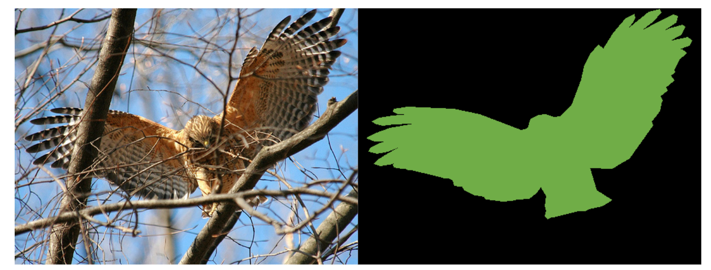
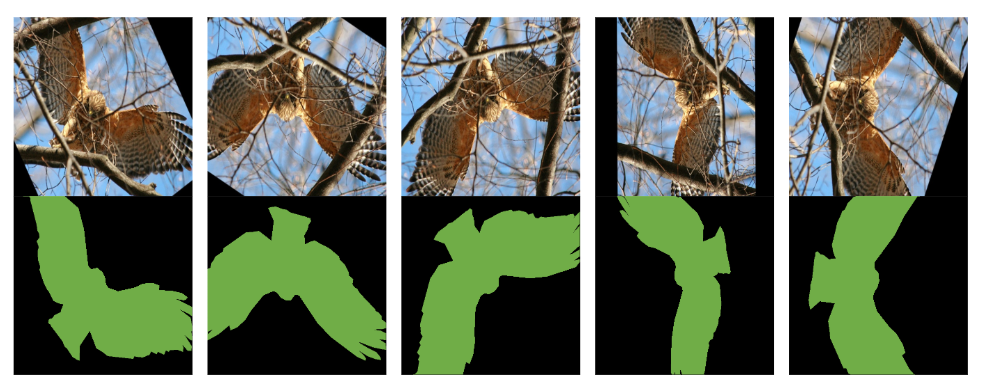

# Spin Augment for Segmentation Training: 支持**旋转任意角度**

可以对以 JSON 文件存储的 COCO 格式分割标注进行**旋转增强**

增强前：


增强后：


使用样例见pipeline.py

1. 环境安装：

推荐使用conda

```bash
conda create -n spin_aug python=3.10
conda activate spin_aug
# 使用 阿里云 的 pip 源 按装依赖
pip install -r requirements.txt -i https://mirrors.aliyun.com/pypi/simple
```
2. 在pipeline.py中的第7行设置原始数据集目录：
```python
# 混合存放原图和原始标注的文件夹
example_datadir = "./example_data"
```
3. 在函数 augment_image_and_annotation 中设置数据增强的参数，若不设置则采用默认值
```python
augment_image_and_annotation(imagefilepath, # 图片文件路径
                             labelfilepath, # 图片对应的标注文件文件
                             i, 
                             angles=180, # 旋转角度，可以任意设置
                             crop_scale=[0.8, 0.99], # 在中心区域随机裁剪占比边长0.8～0.99的方框
                             target_size=(513, 513)) # 最终数据集图片和标注的大小
```
4. 运行
```bash
# pipeline中注释含有处理流程
python pipeline.py
```
